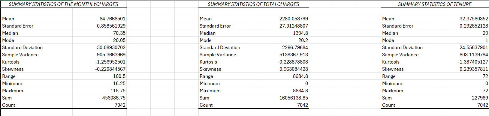
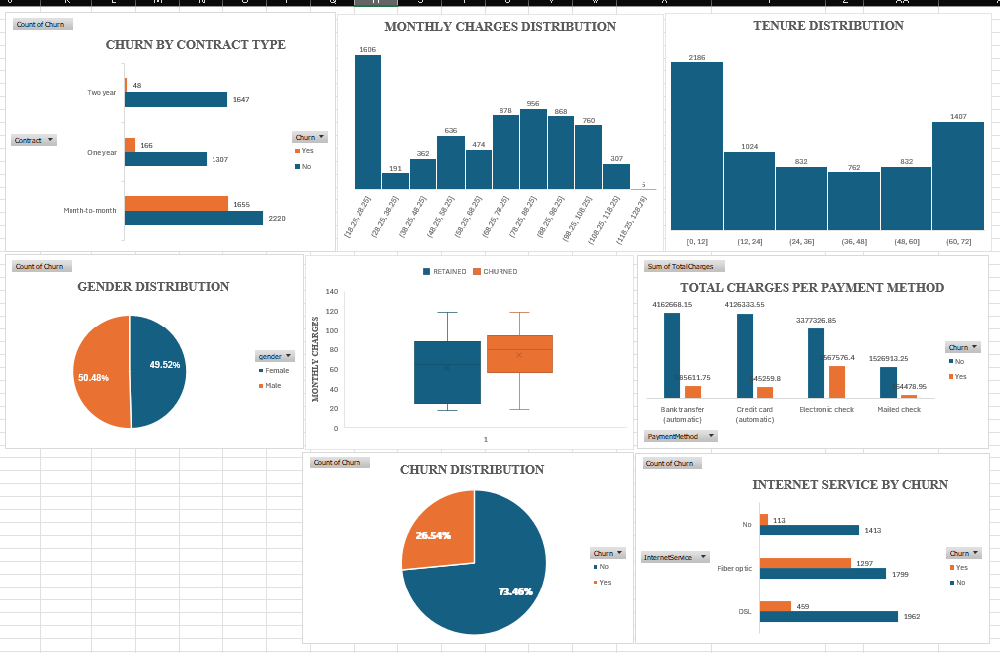
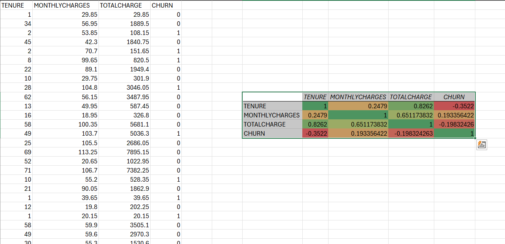

# Week 1 – Customer Behaviour & Business Performance Analysis

## 📌 Project Overview
This project was part of the AnalystLab Africa Data Analytics Internship (Week 1).  
The task was to investigate **customer churn** for ABC Communications Ltd using the Telco Customer Churn dataset.

## 🛠 Business Problem
ABC Communications wanted to understand why customers leave and identify strategies to improve retention.  
The analysis focused on customer demographics, contract types, services, and payment methods.

## 📊 Analysis & Visuals
- **Charts created**: 3 bar charts, 2 pie charts, 2 histograms, 1 box plot, 1 correlation heatmap.
- **Key focus areas**: Customer base profile, churn by segment, contract type influence, tenure impact, services and payment methods.

## 🔎 Key Insights
1. Customers on **month-to-month contracts** show the highest churn.
2. **Short-tenure customers** are more likely to leave, while long-tenure customers are loyal.
3. **Electronic check payment method** has the highest churn rate.
4. Customers with **multiple services (internet, phone, streaming)** churn more often.
5. Senior citizens and single-line customers show higher churn compared to younger or bundled-service customers.

## ⚠️ Risks
- High churn among month-to-month contracts.
- Vulnerability in electronic check payments.
- Loss of revenue from short-tenure customers leaving early.

## 🌱 Opportunities
- Promote long-term contracts with incentives.
- Encourage secure payment methods (credit card, bank transfer).
- Bundle services to improve loyalty and reduce churn.

## 🧩 Skills Developed
- Data inspection (missing values, duplicates, data types).
- Exploratory analysis in Excel.
- Visualisation (bar, pie, histograms, box plots, heatmaps).
- Communicating insights and recommendations professionally.

## 📷 Charts, Summary Stats and Correlation heatmap

